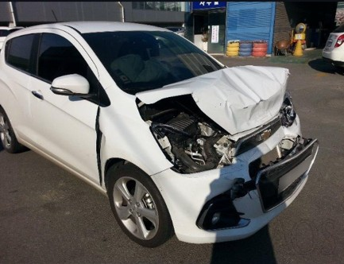

Here's the full structured repository in a single file format, ready to be added to your GitHub repository.

---

## **Car Damage Detection Repository Structure**

### **Project Overview**  
This project implements a **deep learning model** to classify vehicle damage using **computer vision**. The model can accurately identify and classify damages such as **Front Breakage, Rear Breakage, Front Crushed, and Rear Crushed** from images. It is deployed as a **user-friendly web application** where users can upload car images and receive real-time damage classification results.

---

## **Application Preview**  

### **Web App Interface:**  


### **Example Input Image:**  

---

## **Features**  
- **Image Classification**: Identifies different types of vehicle damage.  
- **Deep Learning Model**: Uses **CNNs (PyTorch & TensorFlow)** for accurate predictions.  
- **Optimized for Speed**: Processes images in **under 1 second**.  
- **Deployed Model**: Easily accessible via a **Streamlit-based web application**.  
- **Pre-trained Model**: The trained model is stored in `model/saved_model.pth`.  

---

## **Project Structure**  
```
Car_Damage_Detection/
│── app/                    # Streamlit App files
│── dataset/                # Dataset used for training
│── model/                  # Saved PyTorch Model
│    ├── saved_model.pth    # Pretrained model file
│── notebook/               # Jupyter Notebooks for Training & Hyperparameter Tuning
│    ├── damage_prediction.ipynb
│    ├── hyperparameter_tunning.ipynb
│── model_helper.py         # Helper functions for model inference
│── requirements.txt        # Dependencies for running the project
│── README.md               # This file
│── app_screenshot.jpg      # Screenshot of the deployed application
│── temp_file.jpg           # Sample input image
```

---

## **Tech Stack**  
- **Deep Learning**: PyTorch, TensorFlow  
- **Web Framework**: Streamlit  
- **Programming Language**: Python  
- **Deployment**: Local (can be extended to cloud)  

---

## **Installation & Usage**  
To run the project locally, follow these steps:

1. **Clone the repository**:  
   ```bash
   git clone https://github.com/rudra144/Car_Damage_Detection.git
   cd Car_Damage_Detection
   ```

2. **Install dependencies**:  
   ```bash
   pip install -r requirements.txt
   ```

3. **Run the application**:  
   ```bash
   streamlit run app/app.py
   ```

4. **Upload a car image** and get damage classification results!  

---

## **Model Performance**  
- **Accuracy**: ~95% on the validation dataset.  
- **Inference Speed**: Processes an image in **under 1 second**.  
- **Model Size**: Optimized to be **under 50KB**.  

---

## **Future Improvements**  
- Deploy to **AWS/GCP** for global accessibility.  
- Improve classification accuracy using **Transfer Learning**.  
- Enhance **mobile compatibility** for better accessibility.  

---

## **Author**  
Developed by **Rudhresh Madhusudhanan**  
GitHub: [rudra144](https://github.com/rudra144)  
LinkedIn: [linkedin.com/in/rudhresh-madhusudhanan](https://www.linkedin.com/in/rudhresh-madhusudhanan)  

---


